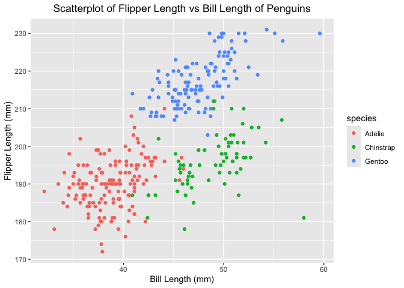

p8105_hw1_fl2715
================
Fengwei Lei

Firstly, we load necessary library *tidyverse* for Problem 1 and 2.

# Problem 1

## *1.1 Load Penguins Dataset*

We load the “penguins” dataset from the package “palmerpenguins”.

## *1.2 Description of the Penguins Dataset*

The penguins dataset contains data on three penguin species (Adelie,
Gentoo, Chinstrap), which were collected from 3 islands (Torgersen,
Biscoe, Dream) between 2007 and 2009. The other important variables
include bill length (bill_length_mm), bill depth (bill_depth_mm),
flipper length (flipper_length_mm) and body mass (body_mass_g). This
dataset consists of 344 rows and 8 columns. And the mean flipper length
of the penguins is 200.9152047 mm.

## *1.3 Scatterplot*

In this part, we make a scatterplot of *‘flipper_length_mm’* vs
*‘bill_length_mm’*. First, to avoid errors caused by missing values
during plotting, we remove the observations with missing data from the
dataset. We use flipper length (mm) as the y-axis and bill length (mm)
as the x-axis to create a scatter plot, and we use different colors to
distinguish between different penguin species. In this way, we obtain
the following scatter plot and named it *‘Scatterplot of Flipper Length
vs Bill Length of Penguins’*.

<!-- -->

## *1.4 Export the Plot*

Finally, we export the above scatterplot to our project directory.

# Problem 2

## *2.1 Create the data frame*

We create a data frame that satisfies the requests for problem 2.
Firstly, for the reproducibility of the code, we set the seed as 1234.
Variable names are defined as *‘normal_sample’*, *‘logical_vector’*,
*‘character_vector’*, *‘factor_vector’* for the variables random sample,
logical vector, character vector, and factor vector respectively. A part
of this dataframe is as follows.

    ##   normal_sample logical_vector character_vector factor_vector
    ## 1    -1.2070657          FALSE                a        Level1
    ## 2     0.2774292          FALSE                b        Level2
    ## 3     1.0844412          FALSE                c        Level3
    ## 4    -2.3456977           TRUE                d        Level1
    ## 5     0.4291247           TRUE                e        Level2
    ## 6     0.5060559          FALSE                f        Level3

## *2.2 Compute Means*

We use the pull funtion to calculate the means of variables. The results
shows that the *‘normal’* and *‘logical’* variable work, but the
*‘character’* and *‘factor’* varibale do not work.

## *2.3 Numeric Conversion*

In this part, we convert logical, character, and factor vectors to
numeric.

``` r
numeric_logical=as.numeric(pull(df, logical_vector))
numeric_character=as.numeric(pull(df, character_vector))
numeric_factor=as.numeric(pull(df, factor_vector))
```

For logical variable, it is converted into 0-1 variable, where 0=FALSE
and 1=TRUE. We could take the mean, and it can directly calculate the
proportion of TRUE values.

For character variable, results shows **NA** and R conveys warning. And
it will fail to make any numerical operations based on this data (such
as calculating the mean).

For factor variable, it is converted into the factor’s underlying
numeric codes, where ‘1=Level 1’, ‘2=Level 2’ and ‘3=Level 3’. Although
we can compute the mean, the result reflects the mean of the numeric
codes rather than the meaning of the categories themselves. So this
result is meaningless.
